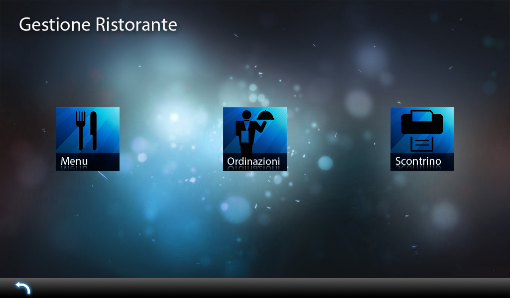
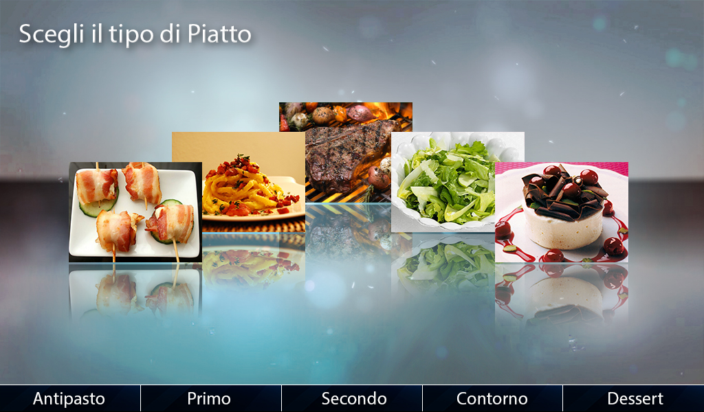
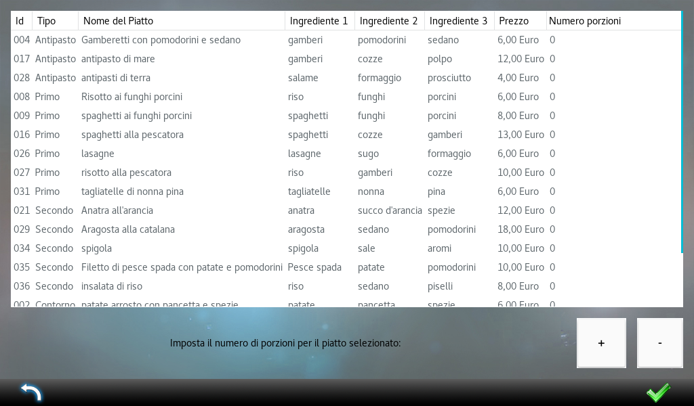
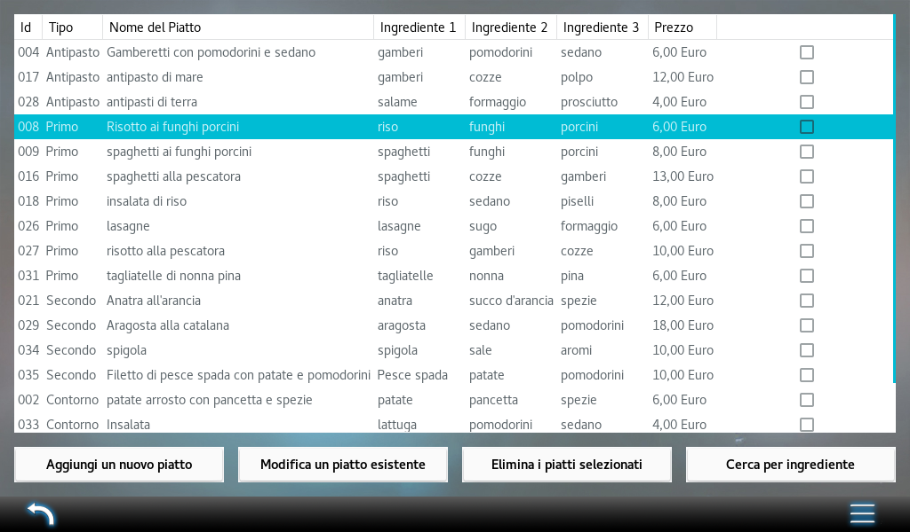

# PR1 Final Project
This repository contains the source code of the final project of an introductory course on programming at the University of Cagliari.

The project deals with the management of a restaurant, allowing the user to:
* Edit the menu of the restaurant;
* Search courses by ingredient;
* Take orders;
* See the bill of a given table.

The project has been implemented in the C language, using the GTK libraries for the user interface.

## Build and Run
The repository already contains a pre-built version of the project.
Simply run:
```console
$ ./restaurant-manager
```

If you want to build the project from scratch, then you first need to be sure to have all the required libraries.
On Ubuntu, you can install all the requirements by running the following command:
```console
$ sudo apt-get install build-essential gnome-devel
```
Now, you are ready to build the project:
```console
$ gcc *.c `pkg-config --cflags --libs gtk+-2.0` -o restaurant-manager
```

This will create the ```restaurant-manager``` executable file. To run the project, just type:
```console
$ ./restaurant-manager
```

## Screenshots
|
-|-
|
